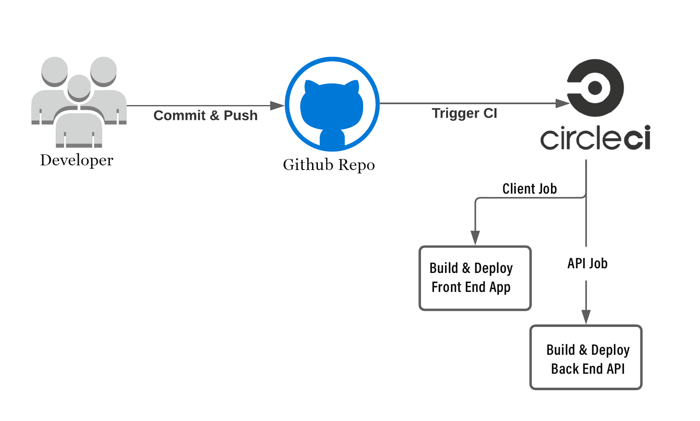

## Storefront Pipeline

### Continuous Integration
#### GitHub
The developer commit and push their code to the GitHub repository which is linked to the CircleCI platform.
GitHub triggers the CircleCI platform when code is pushed to the repository.

#### CircleCI
CircleCI reads the `.circleci/config.yml` file which tells the service what has to be done. In the case of Storefront,
there are 2 jobs (Build & Deploy) to be run by CircleCI.
- **Build**: Runs the `install:client` and `install:server` to install dependencies, then it runs `build:client` and `build:server` scripts given in the `package.json` file.
- **Deploy**: Runs the `deploy:client` script to use AWS CLI to upload front-end assets to S3. Then uses AWS CLI to upload API archive to S3. 
